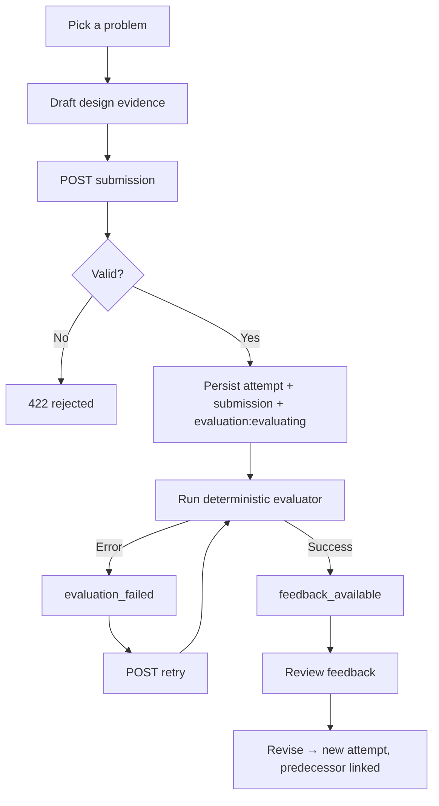
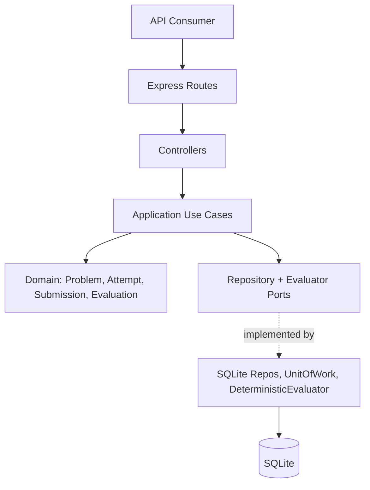

# LLD Practice Platform

* A backend-powered platform to practice Low-Level Design (LLD) interview problems (parking lot, elevator, etc.), to submit a structured design, get deterministic rubric-based feedback, retry on failure and revise without losing history

### Why this exists

* LLD problems have no single correct answer, making their grading different from coding problems.
* No single correct answer → can't compare against one canonical class diagram
* No real feedback loop → most practice is done by reading someone else's solution, not getting feedback on one's own
* Evaluation can fail independently of design quality → a crashed evaluator shouldn't cost you your submission
* Real interviews are iterative → you're asked to adapt your design when requirements change, not solve once and move on

### What's built (MVP)

* Problem catalog seeded with LLD problems (requirements, constraints, edge cases, change scenarios)
* Structured design submission — entities, responsibilities, relationships, behaviors, design decisions, interfaces, assumptions
* Submission validated for completeness before it's accepted
* Attempt + submission + evaluation persisted atomically, before evaluation runs
* Deterministic rubric evaluator across 5 design dimensions → qualitative, explainable feedback (no numeric score)
* Retry API for failed evaluations — no resubmission needed
* Revisions create a new attempt linked to its predecessor, so history isn't overwritten
* Full test suite: domain, use-cases, infrastructure, integration, API


> The `client/` folder has an initial React/Vite scaffold, but the working prototype right now is backend + REST API, driven by the automated test suites and Postman.

## Tech stack

| Layer | Tech |
|---|---|
| Runtime | Node.js 18+ |
| Server | Express 5 |
| Database | SQLite (`better-sqlite3`, WAL mode) |
| Validation | Zod + custom domain validators |
| Testing | Vitest + Supertest |
| Frontend (scaffold only) | React 19 + Vite |

## How a submission flows



The important part: **the submission is saved before evaluation runs.** If the evaluator throws, the work isn't lost — it just sits in `evaluation_failed` until retried.

## Architecture

Layered so domain rules don't know SQLite or Express exist.



- **Domain** (`server/src/domain/`) — plain JS entities and value objects, zero framework/DB dependencies
- **Application** (`server/src/application/`) — use cases (`SubmitDesign`, `RetryEvaluation`, ...) that talk to ports, not implementations
- **Infrastructure** (`server/src/infrastructure/`) — SQLite repos, the `UnitOfWork` transaction, the rubric evaluator
- **API** (`server/src/routes/`, `controllers/`) — Express routes + centralized error middleware mapping domain errors to HTTP codes

Evaluation sits behind an `Evaluator` port, so a future LLM-based evaluator can be swapped in without touching the practice flow.

## Domain model

```
Problem (1) ──< Attempt (0..*) ── Submission (1) ── Evaluation (1)
                                       │                 │
                                  DesignEvidence    FeedbackReport
```

| Entity | What it's for |
|---|---|
| `Problem` | The LLD challenge — requirements, constraints, scope, change scenarios |
| `Attempt` | One learner session; optionally linked to a `predecessorAttemptId` for revisions |
| `Submission` | Immutable snapshot of what was submitted |
| `DesignEvidence` | Structured evidence: entities, responsibilities, relationships, behaviors, decisions, interfaces, assumptions |
| `Evaluation` | Lifecycle: `evaluating → feedback_available / evaluation_failed`; only failed ones can retry |
| `FeedbackReport` | Qualitative findings — priority / secondary / optional, no numeric score |

## Evaluation rubric

The evaluator is fully deterministic — no LLM, no external API, fully reproducible.

| Dimension | Checks |
|---|---|
| Requirement coverage | Do requirements show up in the submitted evidence |
| Responsibility assignment | Are responsibilities spread across entities, not dumped on one |
| Structure & coupling | Are there real relationships between entities |
| Behavioral coherence | Is there actual behavior modeled, not just static data |
| Extensibility & rationale | Did the learner explain *why* they made a decision |

## API

| Method | Endpoint | Purpose |
|---|---|---|
| GET | `/api/health` | Health check |
| GET | `/api/problems` | List problems |
| GET | `/api/problems/:problemId` | Problem details |
| GET | `/api/problems/:problemId/attempts` | Attempt history for a problem |
| POST | `/api/problems/:problemId/submissions` | Submit a design |
| GET | `/api/attempts/:attemptId` | Attempt + submission + evaluation |
| POST | `/api/attempts/:attemptId/evaluation/retry` | Retry a failed evaluation |

# How to Run

## Prerequisites

Install:

* Node.js 18+
* npm

---

## 1. Clone the repository

```bash
git clone https://github.com/abhirajkr16/LLD-Practice-Platform.git
cd LLD-Practice-Platform
```

---

## 2. Install backend dependencies

From the project root:

```bash
npm install
```

---

## 3. Install frontend dependencies

```bash
cd client
npm install
cd ..
```

---

## 4. Start the backend

From the project root:

```bash
npm run dev
```

The backend runs on:

```text
http://localhost:3000
```

---

## 5. Start the frontend

Open another terminal:

```bash
cd client
npm run dev
```

Vite will provide the local frontend URL.

---

# Environment Variables

The current MVP does not require external API keys or third-party services to run the core application.

The frontend currently communicates with:

```text
http://localhost:3000/api
```

If the backend URL needs to change later, it can be moved into a frontend environment variable instead of keeping it hardcoded.

No secrets should be committed to the repository.

---

# Database Setup

The project uses SQLite through `better-sqlite3`.

The database is stored locally as:

```text
data/app.db
```

The schema is initialized when the backend starts.

Initial problems are seeded from:

```text
server/src/database/seed.js
```

The seed script uses idempotent inserts, so existing problem records are not duplicated when the seed process is run again.

To seed the problems manually:

```bash
node server/src/database/seed.js
```

The main database concepts are:

```text
problems
attempts
submissions
evaluations

## Testing

```
domain-test.js          → pure domain logic
application-test.js     → use cases with in-memory fakes
infrastructure-test.js  → SQLite repos
integration-test.js     → full flow, real DB
api.test.js / retry-*   → HTTP via Vitest + Supertest
```

Run everything: `npm test -- run`

## Repository Structure

```text
LLD-Practice-Platform/
│
├── client/
│   └── src/
│       ├── api/
│       ├── pages/
│       ├── routes/
│       └── App.jsx
│
├── server/
│   └── src/
│       ├── application/
│       │   ├── ports/
│       │   └── use-cases/
│       │
│       ├── controllers/
│       │
│       ├── database/
│       │   ├── schema.sql
│       │   ├── init.js
│       │   └── seed.js
│       │
│       ├── domain/
│       │   ├── attempt/
│       │   ├── evaluation/
│       │   ├── feedback/
│       │   ├── problem/
│       │   └── submission/
│       │
│       ├── infrastructure/
│       │   ├── database/
│       │   ├── evaluation/
│       │   └── repositories/
│       │
│       ├── middleware/
│       ├── routes/
│       └── server.js
│
├── data/
│   └── app.db
│
├── AI_USAGE.md
├── package.json
└── README.md

## Limitations (on purpose, not by accident)

- Keyword/heuristic rubric matching, not semantic understanding
- No auth / multi-tenant users yet
- Evaluation runs synchronously in the request cycle — no background queue
- Frontend scaffold exists but isn't wired to the API yet
- Problems are added via seed scripts, not an admin UI

## Where this could go next

- Swap in an `LLMEvaluator` behind the existing `Evaluator` port for semantic feedback
- Wire up the React client for browsing problems and submitting designs
- Move evaluation to a background worker
- Add auth + per-user attempt history
- Accept UML diagrams as an alternate submission format

## Author

Abhiraj Kumar — abhirajmait16@gmail.com


#AI Usage

## Purpose

AI tools were used as development assistants during the project for architecture exploration, implementation support, debugging, and review.
The final architecture, feature scope, and implementation decisions were reviewed against the assignment requirements and tested in the working application. AI suggestions were treated as inputs, not as final decisions.

## 1. Deterministic Evaluation Instead of an LLM-Only Evaluator

### Problem

The platform needs to evaluate learner LLD submissions and return useful, repeatable feedback.

### AI-assisted consideration

An AI-based evaluator was considered because an LLM can understand free-form design explanations and generate qualitative feedback.

### Decision

For the MVP, I used a deterministic evaluator based on a defined set of evaluation dimensions.

### Why

- Results are reproducible.
- The evaluator is easier to test.
- Feedback can be traced to submitted evidence.
- There is no external AI API dependency or API cost.
- Failures are easier to reproduce and debug.

### Final implementation

The evaluator checks the submitted design against dimensions such as:

- Requirement Coverage
- Responsibility Assignment
- Structure and Coupling
- Behavioral Coherence
- Extensibility and Rationale

A future LLM evaluator can be added behind the evaluator boundary without changing the main learner workflow.

## 2. Separating Submission from Evaluation

### Problem

A learner's design should not be lost if evaluation fails.

### AI-assisted consideration

Different ways of connecting submission and evaluation were considered, including treating evaluation as part of the submission operation.

### Decision

I kept submission persistence separate from evaluation.

### Why

The submitted design is valuable even when the evaluator fails. This also makes retry behavior possible without asking the learner to submit the design again.

### Final flow

```text
Submit Design
      ↓
Persist Attempt + Submission
      ↓
Run Evaluation
      ↓
Completed / Failed
```

The submission remains available when evaluation fails.

## 3. Revision Creates a New Attempt

### Problem

A learner may want to improve a design after receiving feedback.

### AI-assisted consideration

Two approaches were considered:

- Update the existing submission.
- Create a new attempt containing the revised design.

### Decision

A revision creates a new attempt.

```text
Attempt 1
   ↓
Attempt 2
   ↓
Attempt 3
```

Each revised attempt can keep a reference to its predecessor.

### Why

This preserves the learner's history and makes it possible to compare how the design changed over time.
It also avoids overwriting the original submission and keeps evaluation results attached to the correct version.

## 4. Structured Text as the MVP Submission Format

### Problem

The platform needs enough design information to evaluate LLD thinking without spending most of the assignment time building a complex submission editor.

### AI-assisted consideration

Possible submission formats included code, diagrams, free-form text, and structured text.

### Decision

The MVP uses structured textual design evidence.
The submission captures:

- Entities
- Responsibilities
- Relationships
- Behaviors
- Design Decisions
- Interfaces
- Assumptions

### Why

This provides enough evidence for the current evaluation dimensions while keeping the implementation focused on the core learner journey.
It also avoids adding unnecessary complexity such as:

- UML/diagram editing
- Diagram parsing
- Code execution
- Sandboxed execution environments

A richer submission format can be introduced later without changing the overall attempt/evaluation model.

## 5. Simple Modular Backend Instead of Distributed Services

### Problem

The project needs clear boundaries between the API, application logic, domain logic, and persistence layer.

### AI-assisted consideration

A more distributed architecture could separate problems, submissions, and evaluation into independent services.

### Decision

I kept the MVP as a modular backend rather than introducing microservices.

```text
React Client
     ↓
Express API
     ↓
Application Use Cases
     ↓
Domain
     ↓
Infrastructure
     ↓
SQLite
```

### Why

The assignment is primarily an LLD/domain-design exercise. A distributed architecture would add operational complexity without improving the core learner experience for this MVP.
The current boundaries still allow the evaluator, persistence layer, or other components to evolve independently.

## AI Tools and Development Assistance

AI assistance was used in areas including:

- Exploring implementation approaches.
- Reviewing frontend and backend structure.
- Debugging API and routing issues.
- Improving error handling and UI states.
- Reviewing edge cases and workflow behavior.
- Generating implementation drafts that were then adapted and tested.

AI-generated code was not treated as automatically correct. Code was reviewed, integrated into the existing project structure, and tested through the application workflow.

## What I Kept Under My Own Review

I specifically reviewed:

- Whether the implementation matched the assignment scope.
- Whether domain responsibilities were placed in the correct layer.
- Whether submission history was preserved.
- Whether evaluation failure could be retried safely.
- Whether revision created a new attempt rather than overwriting history.
- Whether the frontend flow matched the intended learner journey.
- Whether the final project avoided unnecessary infrastructure for the MVP.

## Limitations of AI-Assisted Development

AI suggestions can be technically valid but still be wrong for the project's scope.
For this project, I avoided accepting suggestions simply because they made the architecture more sophisticated. Decisions were evaluated based on:

1. Assignment requirements.
2. MVP scope.
3. Simplicity.
4. Testability.
5. Maintainability.
6. Actual behavior of the running system.

The final implementation is therefore a reviewed and tested result of AI-assisted development, rather than an unmodified AI-generated project.
