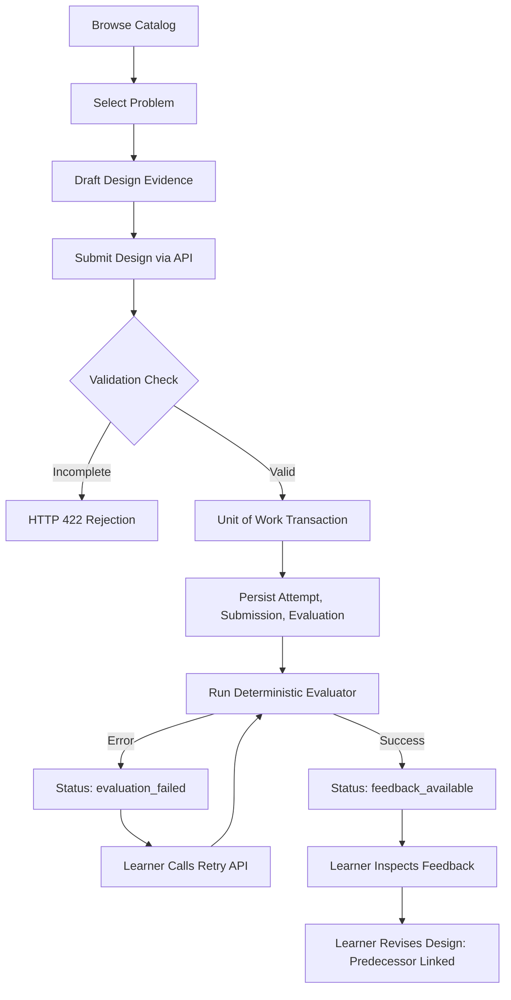
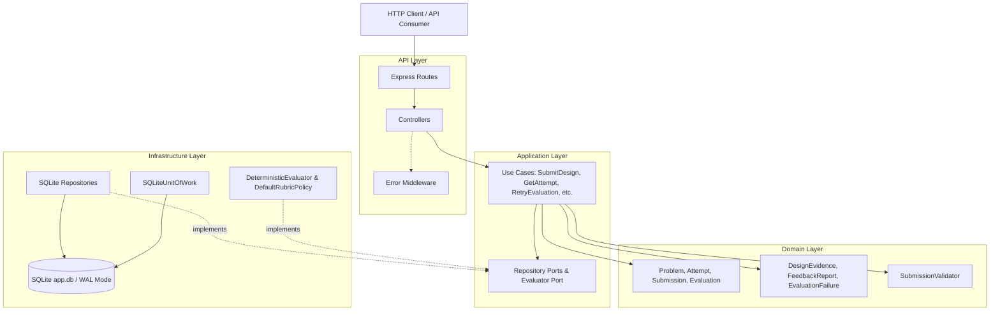

# LLD Practice Platform

LLD Practice Platform is a backend-driven system designed to help software engineers practice Low-Level Design (LLD) on interview-standard problems. Instead of asking learners to write hundreds of lines of boilerplate code or grading them against a rigid "gold standard" class hierarchy, the platform focuses on the structural decisions that matter in design interviews: entity boundaries, responsibility assignment, relationships, behavior modeling, and design rationale.

A learner chooses an object-oriented design problem (such as designing a parking lot or an elevator system), analyzes the requirements, and submits structured design evidence. The system persists the attempt and submission in an immutable audit trail, runs an automated deterministic evaluation against an explicit rubric, and returns actionable, qualitative feedback categorized into priority, secondary, and optional improvements. If an evaluation fails or encounters an error, the learner can retry the evaluation without losing their submitted work.

The project is built as a modular monolith in Node.js, organized cleanly into domain, application, infrastructure, and API layers. This architecture keeps core design rules, persistence concerns, and evaluation policies decoupled, making the system straightforward to test and extend.

---

## Problem

Preparing for object-oriented and low-level design interviews is often frustrating for intermediate software engineers:

1. **No single "correct" solution:** Unlike algorithmic problems with strict input/output matching, LLD problems can be solved validly in multiple ways. Checking code with unit tests or exact class-name matching penalizes valid alternative designs.
2. **Missing feedback loop:** Learners usually read solutions in articles or videos, but they rarely get objective feedback on their own proposed abstractions, coupling choices, or trade-offs.
3. **Loss of work on evaluation failure:** When practice platforms run complex evaluation pipelines that crash, learners often lose their unpersisted draft or submission history.
4. **Lack of practice iteration:** In real interviews, candidates are asked to adapt their design when new requirements appear (e.g., adding a new pricing rule or multi-floor support). Most practice tools treat submissions as one-off tasks without revision history.

---

## MVP

The current Minimum Viable Product (MVP) provides a fully functional backend and persistence pipeline for the complete practice lifecycle:

- **Problem Catalog:** Access seeded interview-standard problems with explicit requirements, constraints, scopes, edge cases, and change scenarios.
- **Structured Submission:** Accept normalized design evidence covering entities, responsibilities, relationships, behaviors, design decisions, interfaces, and assumptions.
- **Completeness Validation:** Enforce that submissions meet minimum structural requirements before accepting them.
- **Transactional Persistence:** Save the attempt, submission, and initial evaluation state inside an atomic Unit of Work transaction before running evaluation logic.
- **Deterministic Evaluation:** Analyze submitted evidence across 5 rubric dimensions using a rule-based evaluation policy that produces explainable, qualitative findings.
- **Evaluation Retry:** Support retrying failed evaluations directly without re-submitting or creating duplicate attempts.
- **Revision Tracking:** Support predecessor attempt linking ("Edit and Try Again") so revision history is preserved.
- **Comprehensive Testing:** Automated test coverage across domain logic, application use cases, SQLite infrastructure, HTTP APIs, and evaluation policies.

*Note on Frontend:* The repository includes an initial React/Vite template under `client/`, but the current working prototype is primarily backend-driven and exercised via REST APIs and automated test suites.

---

## Core Features

- **Seeded Problem Repository:** Problem statements covering multi-floor parking lot allocation and multi-car elevator scheduling.
- **Structured Design Evidence Model:** Accepts classes, responsibilities, associations, methods, design decisions, and assumptions rather than raw unparsed source files.
- **Separation of Lifecycle Concepts:** Distinct `Attempt`, `Submission`, and `Evaluation` models to isolate practice history from evaluation status.
- **Atomic Persistence:** Database commits occur inside an SQLite transaction via a Unit of Work abstraction before evaluation starts.
- **Explainable Feedback Reports:** Feedback is broken down into an overall summary along with prioritized, secondary, and optional findings with underlying evidence.
- **Deterministic Rubric Policy:** Fully offline, reproducible scoring based on keyword requirement coverage, entity-to-responsibility balance, coupling depth, and architectural rationales.
- **Safe Evaluation Retry:** Guards prevent retrying already-completed evaluations while allowing retries for failed states.

---

## How It Works

The platform supports a step-by-step learner practice flow:



### Concrete Example: "Design a Parking Lot System"

1. **Select Problem:** The learner retrieves problem `parking-lot-001`. The response outlines requirements (vehicle entry/exit, spot tracking, multiple floors, fee calculation), constraints, and expected change scenarios.
2. **Draft Design:** The learner identifies entities (`ParkingLot`, `ParkingFloor`, `ParkingSpot`, `Vehicle`), assigns responsibilities, defines relationships (`ParkingLot contains ParkingFloor`), and notes behaviors (`parkVehicle`, `calculateFee`).
3. **State Rationale:** The learner documents a design decision: *"Pricing is decoupled using PricingStrategy to allow changing fee policies without altering parking spot logic."*
4. **Submit Design:** The evidence is posted to `POST /api/problems/parking-lot-001/submissions`.
5. **Persistence First:** An `Attempt` is generated, the `Submission` is stored with its timestamped evidence snapshot, and an `Evaluation` record is created in `evaluating` status—all committed in a single transaction.
6. **Evaluation:** The deterministic evaluator checks evidence against the parking lot rubric. It determines that all requirements are referenced, entity responsibilities are balanced, and an extensibility strategy is present.
7. **Feedback:** The evaluation status transitions to `feedback_available`. The learner retrieves the attempt and inspects their qualitative feedback report.

---

## Architecture

The system follows a strict layered architecture to ensure domain business rules remain completely decoupled from SQLite queries, Express route handlers, and evaluation mechanisms:



### 1. Domain Layer (`server/src/domain/`)
The core of the system. Contains plain JavaScript classes and value objects that enforce business invariants without any dependencies on Express or better-sqlite3:
- **`Problem`**: Represents the design challenge, requirements, scope, constraints, and change scenario.
- **`Attempt`**: Connects a learner to a problem. Knows whether it has a predecessor (`predecessorAttemptId`) for revision tracking.
- **`Submission`**: An immutable snapshot of the learner's submitted design evidence at a given point in time.
- **`DesignEvidence`**: Normalized value object holding entities, responsibilities, relationships, behaviors, design decisions, interfaces, and assumptions.
- **`Evaluation`**: Manages the evaluation lifecycle (`evaluating` → `feedback_available` or `evaluation_failed`). Enforces that only failed evaluations can be retried.
- **`FeedbackReport`**: Encapsulates qualitative assessment text, dimension findings, and prioritized feedback buckets without numeric scoring.
- **`SubmissionValidator`**: Ensures a submission contains minimum viable evidence (at least one entity, responsibility, behavior, and relationship) before persistence.

### 2. Application Layer (`server/src/application/`)
Coordinates application workflows and use cases. Communicates with external services through abstract ports:
- **Ports (`ports/`)**: Defines interface contracts for `ProblemRepository`, `AttemptRepository`, `SubmissionRepository`, `Evaluator`, and `RubricPolicy`.
- **Use Cases (`use-cases/`)**:
  - `ListProblems`: Queries problems available in the catalog.
  - `GetProblem`: Fetches problem specifications by ID.
  - `GetProblemAttempts`: Fetches attempt history for a specific problem.
  - `SubmitDesign`: Coordinates validation, domain object creation, atomic transaction persistence, and initial evaluation execution.
  - `GetAttempt`: Assembles an attempt with its associated submission and evaluation status.
  - `RetryEvaluation`: Validates that an attempt's evaluation has failed and re-triggers the evaluator.
- **Container (`appContainer.js`)**: Wires production dependencies, repositories, and use cases into singletons.

### 3. Infrastructure Layer (`server/src/infrastructure/`)
Contains technical implementations of ports:
- **Repositories (`repositories/`)**: `SQLiteProblemRepository`, `SQLiteAttemptRepository`, `SQLiteSubmissionRepository`, and `SQLiteEvaluationRepository` translate between database rows and rich domain entities.
- **Unit of Work (`database/SQLiteUnitOfWork.js`)**: Wraps multi-table insertions inside a transactional boundary (`db.transaction()`).
- **Evaluation Engine (`evaluation/`)**:
  - `DefaultRubricPolicy`: Evaluates evidence across 5 dimensions against problem requirements.
  - `DeterministicEvaluator`: Aggregates rubric findings into an overall assessment and categorizes priority, secondary, and optional findings.

### 4. API Layer (`server/src/routes/`, `server/src/controllers/`)
Provides HTTP REST endpoints using Express 5:
- Route definitions under `routes/api/v1/` delegating to controllers (`problem.controller.js`, `submission.controller.js`, `attempt.controller.js`, `evaluation.controller.js`).
- Centralized error handling via `error.middleware.js` mapping domain error codes (`NOT_FOUND`, `INVALID_REQUEST`, `INVALID_PREDECESSOR_ATTEMPT`) to standard HTTP status codes (`404`, `422`, `500`).

---

## Project Structure

```text
LLD-Practice-Platform/
├── client/                     # Frontend workspace (initial React/Vite template)
│   ├── src/
│   │   ├── App.jsx
│   │   └── main.jsx
│   └── package.json
├── data/                       # Local SQLite database directory
│   └── app.db                  # Generated at runtime
├── mdfile/                     # System design notes, rubric specs & research notes
├── server/
│   ├── src/
│   │   ├── application/
│   │   │   ├── ports/          # Interfaces for repositories and evaluators
│   │   │   ├── use-cases/      # Application use cases (SubmitDesign, etc.)
│   │   │   └── appContainer.js # Dependency injection composition root
│   │   ├── controllers/        # Express HTTP controllers
│   │   ├── database/
│   │   │   ├── connection.js   # better-sqlite3 database connection (WAL mode)
│   │   │   ├── init.js         # Schema loader
│   │   │   ├── schema.sql      # DDL table schemas
│   │   │   └── seed.js         # Seed data script for initial problems
│   │   ├── domain/             # Core business logic and entities
│   │   │   ├── attempt/        # Attempt entity
│   │   │   ├── evaluation/     # Evaluation entity & EvaluationFailure VO
│   │   │   ├── feedback/       # FeedbackReport VO
│   │   │   ├── problem/        # Problem entity
│   │   │   └── submission/     # Submission entity, DesignEvidence & Validator
│   │   ├── infrastructure/     # Database adapters & evaluation policy
│   │   │   ├── database/       # SQLiteUnitOfWork
│   │   │   ├── evaluation/     # DefaultRubricPolicy & DeterministicEvaluator
│   │   │   └── repositories/   # SQLite repository implementations
│   │   ├── middleware/         # Error handling middleware
│   │   ├── routes/             # REST route declarations
│   │   └── server.js           # Express app definition & server entrypoint
│   └── test/                   # Automated test suites
│       ├── api.test.js                 # Vitest API integration tests
│       ├── application-test.js         # Use case tests with in-memory fakes
│       ├── domain-test.js              # Pure domain model unit tests
│       ├── evaluation.test.js          # Rubric and evaluator tests
│       ├── infrastructure-test.js      # SQLite repository integration tests
│       ├── integration-test.js         # Full end-to-end SQLite integration test
│       ├── retry-api.test.js           # API retry route tests
│       └── retry-evaluation.test.js    # Domain retry lifecycle tests
├── AI_USAGE.md                 # Documentation of AI development assistance
├── package.json                # Project dependencies and test scripts
├── vitest.config.mjs           # Vitest configuration
└── README.md
```

---

## Domain Model

```text
Problem (1) ──────────< Attempt (0..*)
                          │ (1)
                          │
                          ▼ (1)
                      Submission (1) ────────── (1) Evaluation
                          │                         │
                          ▼ (owns)                  ▼ (produces)
                    DesignEvidence            FeedbackReport
```

1. **`Problem`**: The aggregate root for practice problems. Holds immutable properties: `title`, `statement`, `difficulty`, `requirements` (array), `constraints` (array), `scope` (`inScope`, `outOfScope`), `edgeCases`, `intent`, and `changeScenario`.
2. **`Attempt`**: Tracks a learner's session for a problem. Maintains an optional `predecessorAttemptId`. If present, `hasPredecessor()` is true, denoting an iteration cycle.
3. **`Submission`**: Represents the immutable payload submitted at a specific timestamp. Holds an instance of `DesignEvidence`.
4. **`DesignEvidence`**: A value object storing normalized arrays of:
   - `entities`: Name and purpose of core classes.
   - `responsibilities`: Single responsibilities assigned to entities.
   - `relationships`: Associations between entities (e.g., "contains", "manages").
   - `behaviors`: Dynamic actions or operations (e.g., "parkVehicle").
   - `designDecisions`: Justifications for particular patterns or separations.
   - `interfaces`: Abstract contracts.
   - `assumptions`: Explicit scope assumptions made by the learner.
5. **`Evaluation`**: Tracks judgment status: `evaluating`, `feedback_available`, or `evaluation_failed`. Guards state transitions so completed evaluations cannot be overwritten by a retry.
6. **`FeedbackReport`**: Stores qualitative output grouped into rubric findings without scores.

---

## Application Layer

The application layer coordinates domain entities and persistence ports. It does not perform SQL queries or read HTTP request objects directly.

- **`SubmitDesign` Use Case Flow:**
  1. Retrieves the `Problem` by ID; throws `NOT_FOUND` if absent.
  2. Creates a `DesignEvidence` object and runs `SubmissionValidator`.
  3. If a `predecessorAttemptId` was provided, verifies that it exists and belongs to the same problem.
  4. Instantiates `Attempt`, `Submission`, and `Evaluation` with generated IDs.
  5. Commits all three entities atomically inside `unitOfWork.transaction()`.
  6. Invokes `evaluator.evaluate(problem, submission)`:
     - On success: marks evaluation as completed via `evaluation.complete(feedback)` and persists the update.
     - On error: records failure via `evaluation.fail(...)` and persists the failed state.
  7. Returns serialized JSON representations of the attempt, submission, and evaluation.
- **`RetryEvaluation` Use Case Flow:**
  1. Loads the `Attempt`, `Submission`, and `Evaluation` by attempt ID.
  2. Checks `evaluation.canRetry()`; throws `INVALID_REQUEST` if the evaluation is not in `evaluation_failed` state.
  3. Calls `evaluation.retry()` to return the evaluation to `evaluating` status and saves it.
  4. Re-runs `evaluator.evaluate(problem, submission)` and saves the completed feedback.

---

## Evaluation and Feedback

The evaluation system uses a **deterministic, rule-based evaluator** (`DeterministicEvaluator`) paired with a concrete rubric policy (`DefaultRubricPolicy`). It analyzes the submitted `DesignEvidence` against problem specifications without requiring an external AI API or LLM.

```text
DesignEvidence + Problem
           │
           ▼
  DefaultRubricPolicy
           │
           ▼ (produces)
   Dimension Findings
           │
           ▼
 DeterministicEvaluator
           │
           ▼ (assembles)
    FeedbackReport (Overall Assessment + Priority / Secondary / Optional Findings)
```

### Evaluation Dimensions

The rubric policy inspects 5 foundational object-oriented design dimensions:

| Dimension | Evaluation Criteria | Output Levels |
|-----------|---------------------|---------------|
| **`requirement_coverage`** | Checks whether problem requirement keywords appear within submitted entities, responsibilities, relationships, behaviors, or decisions. | `Strong`, `Adequate`, `Needs Improvement` |
| **`responsibility_assignment`** | Compares the count of explicitly assigned responsibilities against the count of proposed entities to prevent "god objects" or empty classes. | `Strong`, `Needs Improvement` |
| **`structure_and_coupling`** | Checks if at least two explicit relationships exist between components to ensure the system is connected. | `Adequate`, `Needs Improvement` |
| **`behavioral_coherence`** | Checks for at least two defined system behaviors to ensure the design models dynamic operations, not just static data. | `Adequate`, `Needs Improvement` |
| **`extensibility_and_rationale`** | Checks whether the learner documented explicit design decisions and rationales to support future change scenarios. | `Adequate`, `Needs Improvement` |

### Feedback Assembly
`DeterministicEvaluator` maps findings into an actionable report:
- **Priority Findings:** Issues classified as `Critical Gap` or `Needs Improvement` that need immediate attention.
- **Secondary Findings:** Moderate suggestions (`Adequate` or secondary improvements).
- **Optional Findings:** Commendations (`Strong` aspects) or minor enhancements.
- **Overall Assessment:** A high-level qualitative judgment derived from the balance of critical and adequate findings.

---

## API Reference

All routes are prefixed under `/api`.

| Method | Endpoint | Purpose |
|--------|----------|---------|
| `GET` | `/api/health` | Health check route (`{ message: "OK" }`). |
| `GET` | `/api/problems` | List all available practice problems. |
| `GET` | `/api/problems/:problemId` | Fetch details and requirements for a problem. |
| `GET` | `/api/problems/:problemId/attempts` | Fetch past attempts submitted for a problem. |
| `POST` | `/api/problems/:problemId/submissions` | Submit design evidence for evaluation. |
| `GET` | `/api/attempts/:attemptId` | Retrieve attempt details, submission evidence, and feedback. |
| `POST` | `/api/attempts/:attemptId/evaluation/retry` | Retry an evaluation that ended in failure. |

### Example 1: Submit a Design

**Request:**
```http
POST /api/problems/parking-lot-001/submissions HTTP/1.1
Content-Type: application/json

{
  "predecessorAttemptId": null,
  "designEvidence": {
    "entities": ["ParkingLot", "ParkingFloor", "ParkingSpot", "Vehicle"],
    "responsibilities": [
      "ParkingLot manages floors and entry/exit",
      "ParkingFloor manages spot collections",
      "ParkingSpot tracks occupancy state",
      "Vehicle represents the vehicle entering the lot"
    ],
    "relationships": [
      "ParkingLot contains ParkingFloor",
      "ParkingFloor contains ParkingSpot"
    ],
    "behaviors": [
      "Park vehicle",
      "Remove vehicle",
      "Calculate parking fee"
    ],
    "designDecisions": [
      "Pricing strategy is decoupled from spot allocation to allow changing fee policies"
    ],
    "interfaces": ["PricingStrategy"],
    "assumptions": [
      "A vehicle occupies exactly one spot at a time"
    ]
  }
}
```

**Response (`201 Created`):**
```json
{
  "attempt": {
    "id": "attempt-48b9d311-...",
    "problemId": "parking-lot-001",
    "predecessorAttemptId": null,
    "createdAt": "2026-09-10T16:40:00.000Z"
  },
  "submission": {
    "id": "submission-8f2e...",
    "attemptId": "attempt-48b9d311-...",
    "designEvidence": {
      "entities": ["ParkingLot", "ParkingFloor", "ParkingSpot", "Vehicle"],
      "responsibilities": ["..."],
      "relationships": ["..."],
      "behaviors": ["..."],
      "designDecisions": ["..."],
      "interfaces": ["PricingStrategy"],
      "assumptions": ["..."]
    },
    "createdAt": "2026-09-10T16:40:00.000Z"
  },
  "evaluation": {
    "id": "evaluation-91ab...",
    "attemptId": "attempt-48b9d311-...",
    "submissionId": "submission-8f2e...",
    "evaluatorKind": "deterministic",
    "status": "feedback_available",
    "feedback": {
      "overallAssessment": "The design provides evidence across the main evaluation dimensions.",
      "dimensionFindings": [
        {
          "dimension": "requirement_coverage",
          "level": "Strong",
          "message": "The submission provides evidence related to all stated requirements."
        },
        {
          "dimension": "responsibility_assignment",
          "level": "Strong",
          "message": "The proposed entities have explicit responsibilities."
        }
      ],
      "priorityFindings": [],
      "secondaryFindings": [],
      "optionalFindings": []
    },
    "failure": null
  }
}
```

### Example 2: Incomplete Submission Validation Error

If a submission is sent missing mandatory elements (e.g., empty behaviors or relationships):

**Response (`422 Unprocessable Entity`):**
```json
{
  "error": {
    "code": "INVALID_REQUEST",
    "message": "Submission is incomplete."
  }
}
```

---

## Tech Stack

The technologies used in this project are strictly limited to those present in the repository:

- **Runtime:** Node.js (v18+)
- **Server Framework:** Express 5 (`^5.2.1`)
- **Database Engine:** SQLite 3 via `better-sqlite3` (`^13.0.3`)
- **Test Framework:** Vitest (`^5.0.0`) with `supertest` (`^7.2.2`)
- **Validation:** Zod (`^4.5.4`) and custom domain validators
- **Development Tooling:** Nodemon (`^3.1.14`)
- **Language:** JavaScript (CommonJS for backend, ESM for Vitest configuration)
- **Client (Workspace):** React 19 with Vite 8 (initial scaffolding in `client/`)

---

## Database

Persistence is handled locally with SQLite via `better-sqlite3`.

- **File Location:** `data/app.db` (auto-created if `data/` directory exists).
- **Pragmas:** Initialized with Write-Ahead Logging (`WAL`) mode and foreign key enforcement enabled (`PRAGMA foreign_keys = ON`).
- **Initialization:** `server/src/database/init.js` reads and executes `schema.sql` automatically when the server starts.
- **Seeding:** `server/src/database/seed.js` inserts initial problem records using idempotent `INSERT OR IGNORE` transactions.

### Tables Overview

```sql
-- Problems catalog
CREATE TABLE problems (
    id TEXT PRIMARY KEY,
    title TEXT NOT NULL,
    statement TEXT NOT NULL,
    difficulty TEXT NOT NULL,
    requirements TEXT NOT NULL,  -- Stored as JSON string
    constraints TEXT NOT NULL,   -- Stored as JSON string
    scope TEXT NOT NULL,         -- Stored as JSON string
    edge_cases TEXT NOT NULL,    -- Stored as JSON string
    intent TEXT NOT NULL,
    change_scenario TEXT NOT NULL
);

-- Practice attempts
CREATE TABLE attempts (
    id TEXT PRIMARY KEY,
    problem_id TEXT NOT NULL REFERENCES problems(id),
    predecessor_attempt_id TEXT REFERENCES attempts(id),
    created_at TEXT NOT NULL
);

-- Immutable submitted design evidence
CREATE TABLE submissions (
    id TEXT PRIMARY KEY,
    attempt_id TEXT NOT NULL UNIQUE REFERENCES attempts(id),
    design_evidence TEXT NOT NULL,  -- Stored as JSON string
    created_at TEXT NOT NULL
);

-- Evaluation lifecycle & feedback
CREATE TABLE evaluations (
    id TEXT PRIMARY KEY,
    attempt_id TEXT NOT NULL UNIQUE REFERENCES attempts(id),
    submission_id TEXT NOT NULL UNIQUE REFERENCES submissions(id),
    evaluator_kind TEXT NOT NULL,
    status TEXT NOT NULL,          -- evaluating | feedback_available | evaluation_failed
    feedback TEXT,                 -- Stored as JSON string
    failure TEXT                   -- Stored as JSON string
);
```

---

## Testing

The project implements automated testing across multiple testing layers:

```text
Unit Tests (Domain Models & Rubric)
       ↓
Application Layer Tests (Use cases with in-memory fakes)
       ↓
Infrastructure Tests (SQLite repositories)
       ↓
Integration Tests (Real database end-to-end flow)
       ↓
API Tests (Supertest HTTP requests via Vitest)
```

### Running the Tests

1. **Run All Vitest Suites (API, Evaluation & Retry tests):**
   ```bash
   npm test -- run
   # or
   npx vitest run
   ```

2. **Run Pure Domain Unit Tests:**
   Verifies entity immutability, date handling, JSON serialization, and attempt predecessor linking.
   ```bash
   node server/test/domain-test.js
   ```

3. **Run Application Use-Case Tests:**
   Tests `SubmitDesign`, `GetAttempt`, and `RetryEvaluation` with isolated in-memory repository fakes.
   ```bash
   node server/test/application-test.js
   ```

4. **Run Infrastructure Repository Tests:**
   Verifies row-to-domain mapping, query execution, and date parsing with SQLite.
   ```bash
   node server/test/infrastructure-test.js
   ```

5. **Run Full SQLite Integration Test:**
   Executes a complete end-to-end submission lifecycle against the real database file.
   ```bash
   node server/test/integration-test.js
   ```

---

## Setup and Running

### Prerequisites
- Node.js (v18 or higher)
- npm

### 1. Clone Repository
```bash
git clone https://github.com/abhirajkr16/LLD-Practice-Platform.git
cd LLD-Practice-Platform
```

### 2. Install Dependencies
```bash
npm install
```

### 3. Ensure Data Directory Exists
SQLite stores the database in `data/app.db`. Ensure the directory exists:
```bash
mkdir -p data
```

### 4. Seed Practice Problems
Seed the database with the initial LLD problems:
```bash
node server/src/database/seed.js
```
*Output:* `Database schema initialized.` followed by `MVP problems seeded successfully.`

### 5. Start the Server
```bash
npm start
```
*Output:* `Server started on port 3000`

For local development with auto-reload:
```bash
npm run dev
```

### 6. Verify Health Check
In another terminal:
```bash
curl http://localhost:3000/api/health
```
*Response:* `{"message":"OK"}`

---

## Design Decisions and Trade-offs

### 1. Monolithic Architecture
- **Decision:** Keep the platform as a modular monolith in one Node.js application rather than splitting into microservices.
- **Why:** The core challenge of this project is modeling Low-Level Design and object-oriented domain boundaries. A modular monolith provides clear internal layering without distributed networking complexity or deployment overhead.
- **Trade-off:** Independent scaling of the evaluation engine from the REST API is not supported in this architecture.

### 2. Separation of Attempt, Submission, and Evaluation
- **Decision:** Model the session (`Attempt`), the design snapshot (`Submission`), and the evaluation result (`Evaluation`) as three separate entities.
- **Why:** In real practice, a learner's submission should be immutable once received. If evaluation fails due to a timeout or rule error, the submission remains untouched while only the evaluation state transitions to `evaluation_failed`.
- **Trade-off:** Requires joining or querying across three tables to display a single attempt summary view.

### 3. Persistence Before Evaluation
- **Decision:** Commit the `Attempt`, `Submission`, and initial `Evaluation` state (`evaluating`) inside an atomic Unit of Work transaction before calling the evaluator.
- **Why:** Ensures that if the evaluator throws an unhandled error or crashes, the learner's submitted design is safely stored in the database and can be retrieved or retried.
- **Trade-off:** Requires two database writes (initial insert + evaluation completion update) for each submission.

### 4. Structured Design Evidence Instead of Raw Code Parsing
- **Decision:** Accept structured JSON evidence (classes, responsibilities, relationships, behaviors, decisions) rather than compiling raw Java/C++ source code.
- **Why:** Low-Level Design interviews focus primarily on class diagrams, responsibility distribution, and architecture trade-offs. Asking learners for structured evidence isolates the design intent from language syntax and avoids needing sandbox code execution environments.
- **Trade-off:** Learners must summarize their design into structured fields rather than submitting standard `.java` or `.ts` files.

### 5. Deterministic Rule-Based Evaluator for MVP
- **Decision:** Implement a deterministic rubric policy rather than an external LLM API.
- **Why:** Provides fast, predictable, reproducible, and offline-capable feedback for the prototype without API rate limits, tokens, or network latency.
- **Trade-off:** Keyword-based matching cannot understand nuanced semantic naming differences as deeply as an LLM evaluator.

---

## Limitations

- **Rule-Based Rubric Matching:** The current evaluator relies on keyword and structural heuristic checks rather than semantic natural language understanding.
- **No User Authentication:** Attempts are identified by problem and attempt IDs. Multi-tenant user accounts and authentication are not yet implemented.
- **In-Process Evaluation:** Evaluations execute synchronously within the Express request cycle. There is currently no asynchronous worker or background queue (e.g., BullMQ or Redis).
- **Frontend Integration Pending:** While the backend REST API is fully operational and verified, the `client/` directory contains an initial Vite/React scaffolding that has not yet been hooked up to the backend routes.
- **Fixed Problem Catalog:** New problems must currently be added via database migrations or seed scripts rather than an administrative management interface.

---

## Future Scope

- **LLM-Powered Evaluator Adapter:** Implement a new adapter satisfying the `Evaluator` port that leverages an LLM to provide deeper semantic critique, design pattern recommendations, and conversational explanations.
- **Interactive Web Interface:** Build out the React UI in `client/` to let learners browse problems, construct designs in structured input forms, and visualize qualitative feedback with color-coded rubric dimensions.
- **Background Worker Queue:** Offload long-running evaluations to asynchronous background workers to ensure fast API responses.
- **User Accounts and Progress Tracking:** Add authentication to track individual learner history, completed problems, and revision attempts over time.
- **Visual Diagram Support:** Allow learners to submit UML class diagrams or render their submitted relationships into interactive diagrams.

---

## Repository

- **GitHub Repository:** [https://github.com/abhirajkr16/LLD-Practice-Platform](https://github.com/abhirajkr16/LLD-Practice-Platform)

---

## Author

- **Abhiraj Kumar** ([abhirajmait16@gmail.com](mailto:abhirajmait16@gmail.com))
